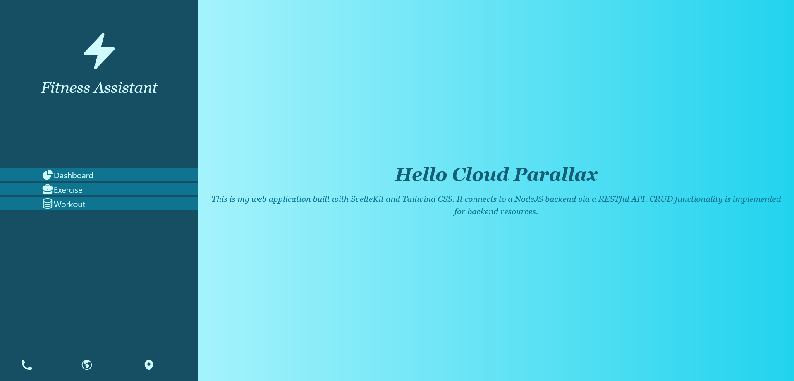
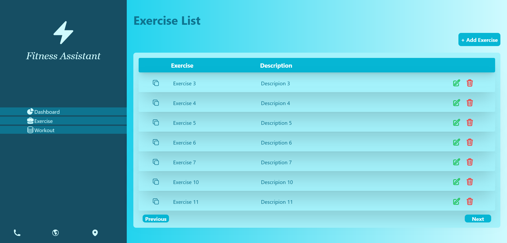
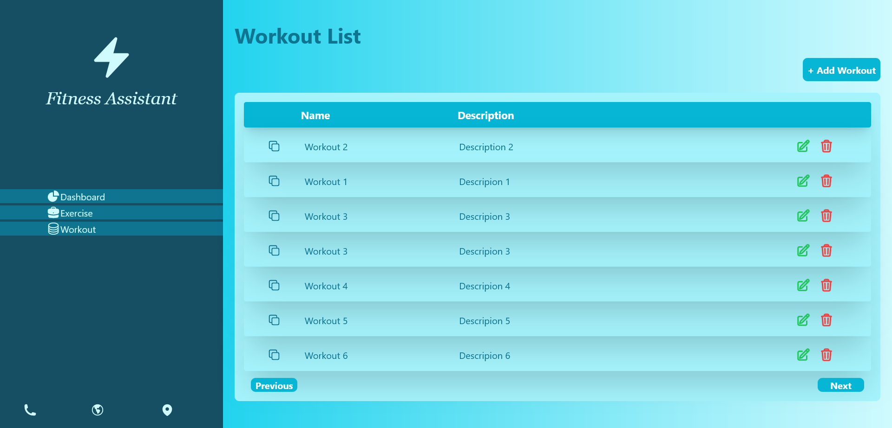
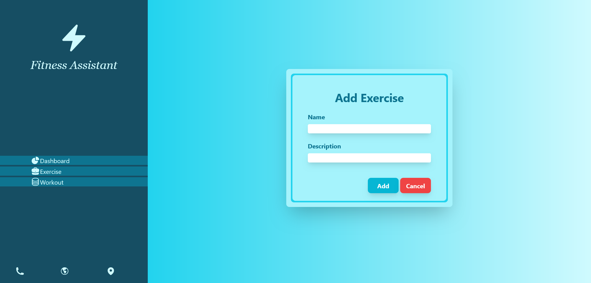
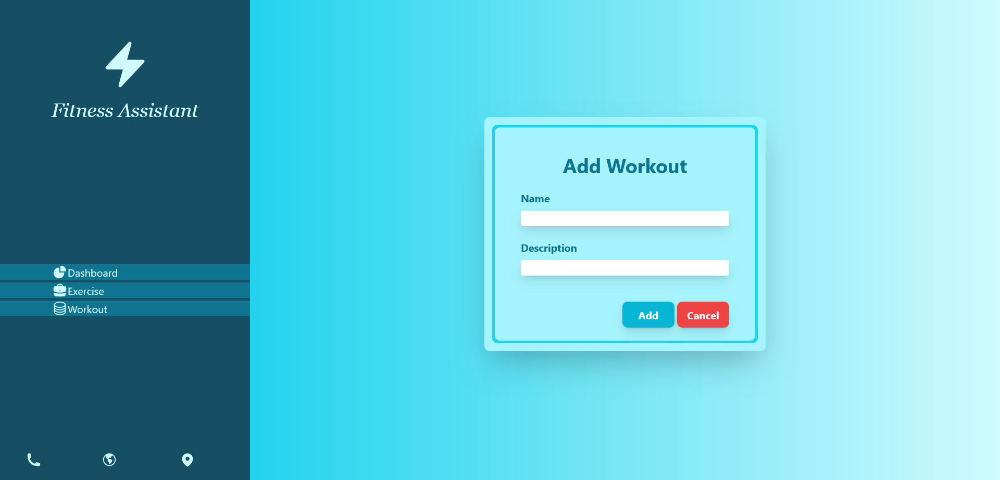

# Fitness Assistant

This is my web application built with SvelteKit and Tailwind CSS. It connects to a NodeJS backend via a RESTful API. CRUD functionality is implemented for backend resources.

## Backend

[Backend Link](https://github.com/Lakrandi-Ayeshani/Fitness_Assistance/tree/main/backend)

## Screenshots

### DashBoard View

### Exercise Page View

### Workout Page View

### Add Exercise Form Page View

### Add Workout Form Page View

